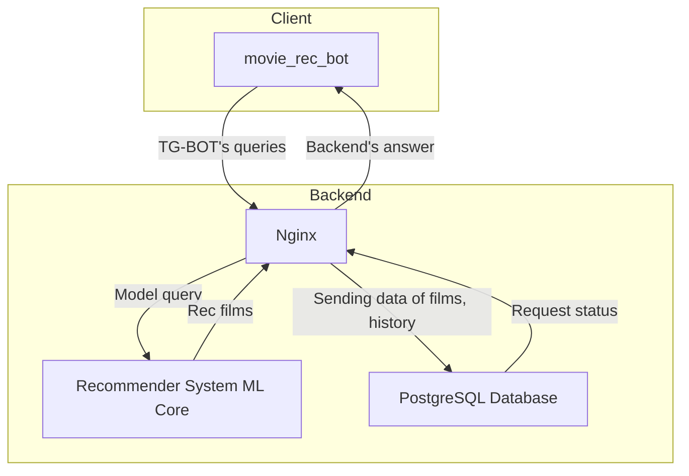
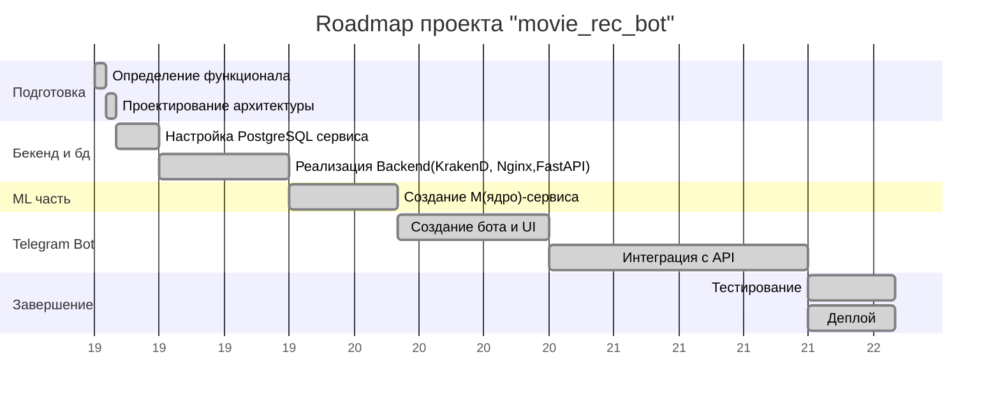

## architectire

```mermaid
    flowchart TD
        subgraph Client
            TG[movie_rec_bot]
        end

        subgraph Backend
            API[Nginx]
            RS[Recommender System ML Core]
            DB[PostgreSQL Database]
        end

        TG -->|TG-BOT's queries| API
        API -->|Sending data of films, history| DB
        API -->|Model query| RS
        RS -->|Rec films| API
        API -->|Backend's answer| TG
        DB --> |Request status| API
```

## roadmap

```mermaid
    gantt
    title Roadmap проекта "movie_rec_bot"
    dateFormat  YYYY-DD
    axisFormat  %d

    section Подготовка
    Определение функционала             :done,    des1, 2025-19, 1h
    Проектирование архитектуры          :done,  des2, after des1, 1h

    section Бекенд и бд
    Настройка PostgreSQL сервиса                :done, b1, after des2, 4h
    Реализация Backend(KrakenD, Nginx,FastAPI)          :done, b2, after b1, 12h

    section ML часть
    Создание M(ядро)-сервиса       :done, c1, after b2, 10h

    section Telegram Bot
    Создание бота и UI            :done, d1, after c1, 14h
    Интеграция с API              :done, d2, after d1, 1d

    section Завершение
    Тестирование                  :done, e1, after d2, 8h
    Деплой                        :done, e2, after d2, 8h

```

### instruments

- tg libs: aiogram
- backend: FastAPI, Nginx, KrakenD
- container: Docker
- CI/CD: GitLab CI
- db: PostgreSQL
- ml: model(sentence-transformer)
