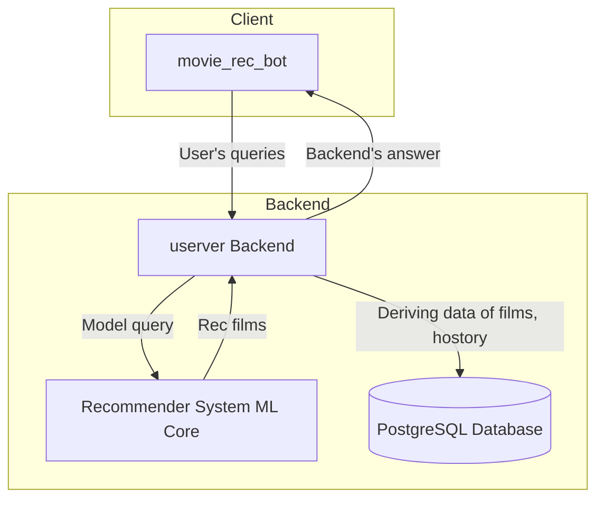
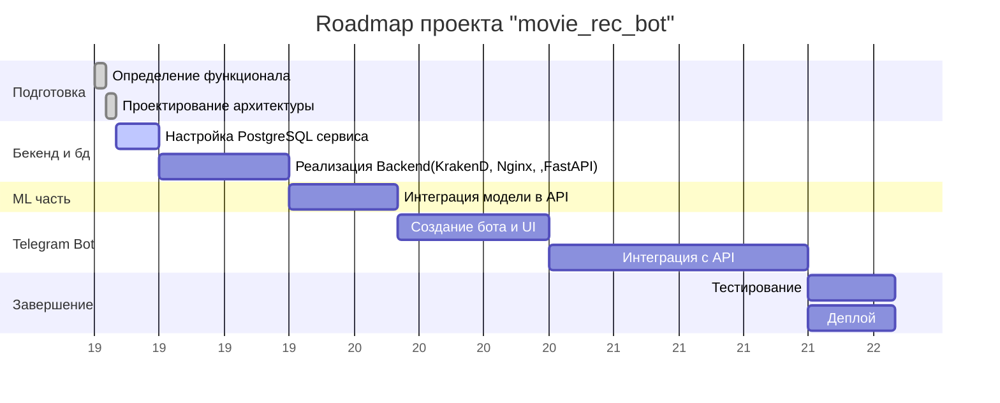

## architectire

## roadmap

### request-response cycle

1. user authorizing: tg-bot(client) send request on API Gateway;
2. server process the query and send query to the DB for auth/reg;
3. user input film: tg -> krakend -> ml_core -> server -> tg
4. user getting 5 similar films with photo, description, aability to resend requery and watch trailer;

### instruments

- tg libs: aiogram
- backend: FastAPI, Nginx, KrakenD, RabbitMQ
- db: PostgreSQL
- ml: model(sentence-transformer)
