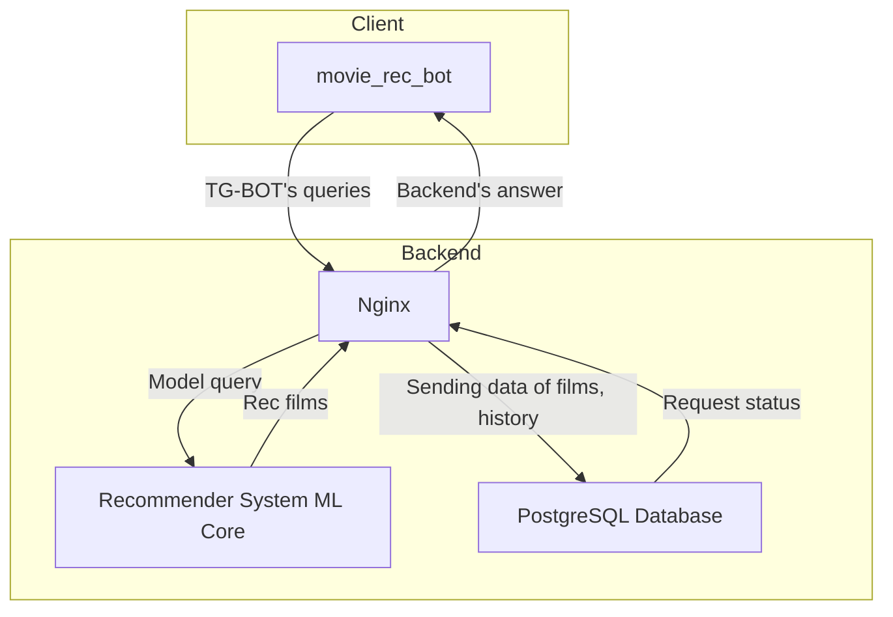
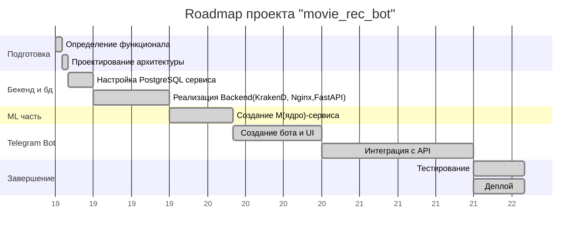

# Movie recommender

Телеграм-бот для интеллектуальной рекомендации фильмов на основе ввденного фильма. Реализована микросервисная архиктура с Krakend API-Gateway, Nginx и ml kernel(content-based sentence-transformer).

---

## Архитектура

---

## Дорожная карта

---

## Технологический стек

### Микросервисная архиктерктура(FastAPI)

#### Database сервис
-  PostgreSQL(история запросов для каждой сессии)
-  SQLModel(для коннекта с постгресом и инициализации моделей данных)
  
#### Ml-ядро сервис
- Sentence-transformer
- Nltk

#### KrakenD сервиса
- KrakenD(API-Gateway) 

#### Nginx сервис
- Nginx(load balancer & reverse proxy)) 

#### Telegram Bot service
- Aiogram

#### Инфраструктура
- Docker, Docker Compose(в каждом сервисе для независимой масштабирования оркестрации сервиса)
- GitLab CI(непрерывная интеграция в гитлаб(только деплой))

## Старт
1. Клонируем репу:
   >git clone https://github.com/Sosylka19/rec_sys.git`
   
2. Переходим в папку проекта
   >cd rec_sys

3. Для удобного поднятия всех сервисов написан Makefile:
    >make start

#### Описание команд Makefile:

-- __make start__ - запускает все контейнеры

-- __make <название сервиса>__ - собирает отдельный сервис с флагом --build

-- __make down_all__ - удаляет все  контейнеры

-- __make down___**<название сервиса>** - удаляет определенный контейнер

